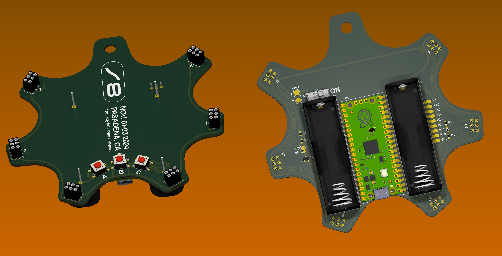
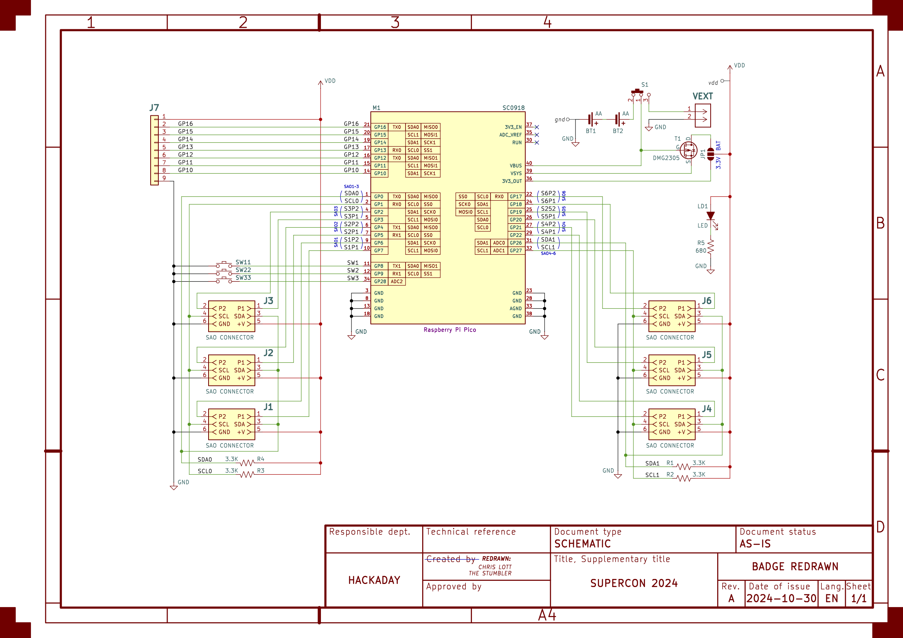
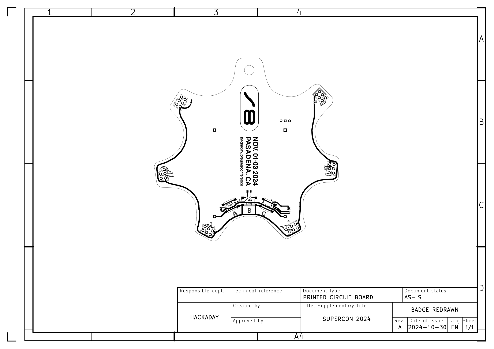
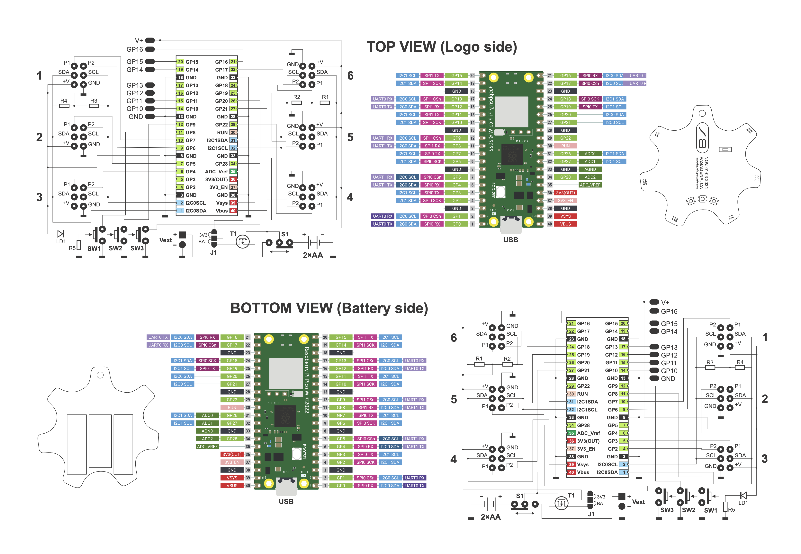
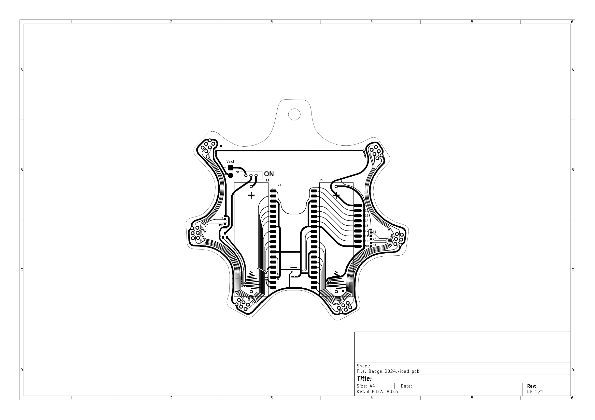

# Redrawing Hackaday Supercon 2024 Badge in Kicad

Making a KiCad version of the Supercon 2024 Badge.
More remarks and possibly corrections to follow.

* [Schematic drawing (PDF)](badge24-schematic.pdf))
* [PCB top drawing (PDF)](badge24-pcb-top.pdf)
* [PCB bottom drawing (PDF)](badge24-pcb-bot.pdf)

## Original Drawings

* [Schematic drawing (PDF)](badge24-original-sch.pdf)
* [PCB top drawing (PDF)](badge24-original-pcb-top.pdf)
* [PCB bottom drawing (PDF)](badge24-original-pcb-bot.pdf)

* [Assembly BOM (XLSX)](badge24-original-and-petal-matrix-bom.xlsx)

